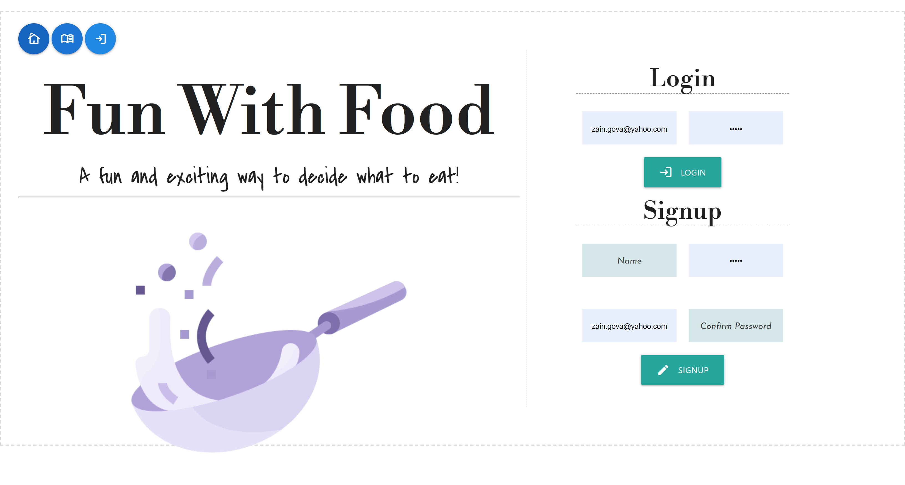
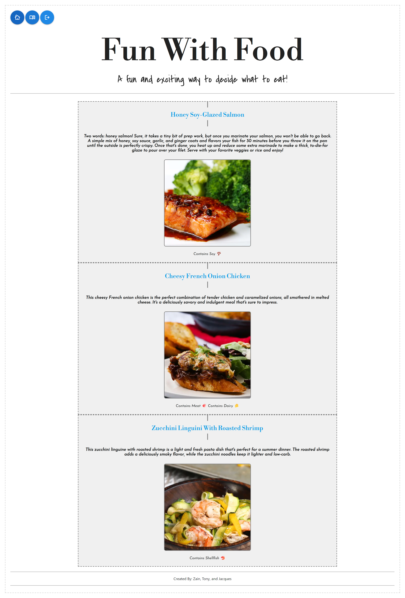

# Fun With Food

## Description

A web application for users to be able to create their own dish list based on selected options and save it. A page containning a list of all dishes is also provided to the user.

## Installation

After making sure that a "dotenv" file is created and the DB_NAME, DB_USER and DB_PASSWORD aligns with your MySQL credentials, users can run:

- "npm i" to install packages

- "npm start" to run the application

- Open (HEROKU URL GOES HERE ** DONT FORGET!!!!!!!!!) to view it in the browser.

## Visuals

### Login Page

### Home Page

### Saved Dishes Page

## Usage

Once the user is signed in, they are redirected to the homepage, where they can select search parameters for dishes they might want to make. After clicking the "generate" button, a random dish with those parameters will appear on the right panel. The user can either click "save" to save that dish to their account, or they can check new search queries and generate a new dish.

To see a list of all saved dishes, the user can click on the center navigation icon. They will be redirected to a new page outlining each dish, with a dish name, dish description, dish image, and which allergens the dish contains. The user can click on the title of each dish to be redirected to the recipe.

## Credits

Zain Gova Github Link: https://github.com/zaingova

Liu Tony Github Link: https://github.com/loltony79

Jacques Martial Traboulga Github Link: https://github.com/jacquesMartial

## License

MIT License

Permission is hereby granted, free of charge, to any person obtaining a copy of this software and associated documentation files (the "Software"), to deal in the Software without restriction, including without limitation the rights to use, copy, modify, merge, publish, distribute, sublicense, and/or sell copies of the Software, and to permit persons to whom the Software is furnished to do so, subject to the following conditions:

The above copyright notice and this permission notice shall be included in all copies or substantial portions of the Software.

THE SOFTWARE IS PROVIDED "AS IS", WITHOUT WARRANTY OF ANY KIND, EXPRESS OR IMPLIED, INCLUDING BUT NOT LIMITED TO THE WARRANTIES OF MERCHANTABILITY, FITNESS FOR A PARTICULAR PURPOSE AND NONINFRINGEMENT. IN NO EVENT SHALL THE AUTHORS OR COPYRIGHT HOLDERS BE LIABLE FOR ANY CLAIM, DAMAGES OR OTHER LIABILITY, WHETHER IN AN ACTION OF CONTRACT, TORT OR OTHERWISE, ARISING FROM, OUT OF OR IN CONNECTION WITH THE SOFTWARE OR THE USE OR OTHER DEALINGS IN THE SOFTWARE.

## Links

Deployed App URL: 

GitHub Repo: https://github.com/jacquesMartial/project2

## Technologies Used

### NPM Packages

- [Sequelize](https://www.npmjs.com/package/sequelize)
- [Connect Session Store](https://www.npmjs.com/package/connect-session-sequelize)
- [bcrypt](https://www.npmjs.com/package/bcrypt)
- [dotenv](https://www.npmjs.com/package/dotenv)
- [Express](https://www.npmjs.com/package/express)
- [Express Handlebars](https://www.npmjs.com/package/express-handlebars)
- [Express-Session](https://www.npmjs.com/package/express-session)
- [MySQL2](https://www.npmjs.com/package/mysql2)

### CSS Libraries

- [Materialize CSS](https://materializecss.com/)

### Other Resources

- [Google Fonts](https://fonts.google.com/)
- [Material Icons/Symbols (Google)](https://fonts.google.com/icons)
